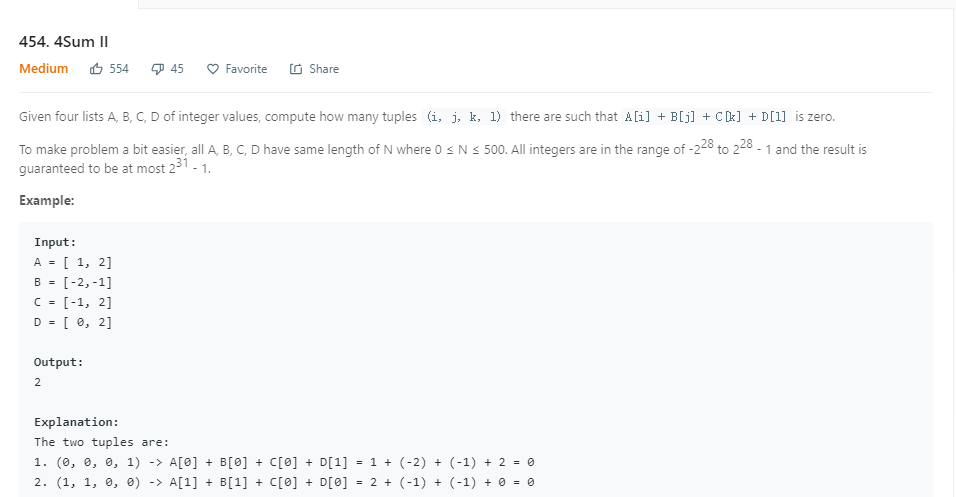

```java
public int fourSumCount(int[] A, int[] B, int[] C, int[] D) {
        if (A == null || B == null || C == null || D == null) {
            return -1;
        }
        Map<Integer, Integer> map = new HashMap<>();
        for (int i = 0; i < A.length; i++) {
            for (int j = 0; j < B.length; j++) {
                int sum = A[i] + B[j];
                map.put(sum, map.getOrDefault(sum, 0) + 1);
            }
        }
        int count = 0;
        for (int i = 0; i < C.length; i++) {
            for (int j = 0; j < D.length; j++) {
                int sum = C[i] + D[j];
                count += map.getOrDefault(-sum, 0);
            }
        }
        return count;
    }
```
* 两个hashmap就可以解决，涉及到求和的问题。一般都可以用hashmap的思想去解决。
