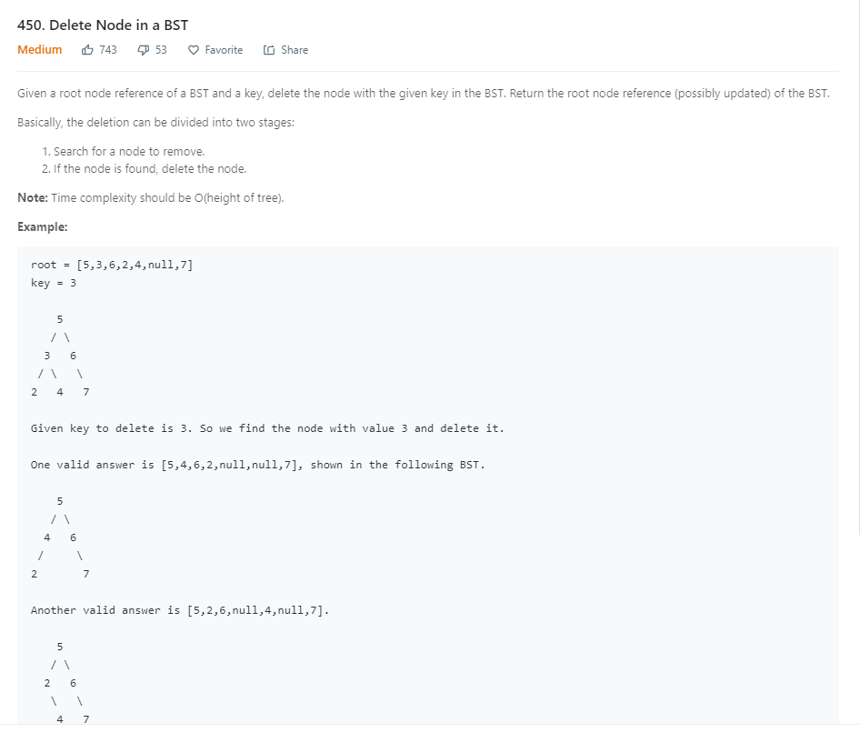

```java
public TreeNode deleteNode(TreeNode root, int key) {
        if (root == null) {
            return null;
        }
        if (key < root.val) {
            root.left = deleteNode(root.left, key);
        } else if (key > root.val) {
            root.right = deleteNode(root.right, key);
        } else {
            if (root.left == null) {
                return root.right;
            } else if (root.right == null) {
                return root.left;
            }

            TreeNode minNode = findMin(root.right);
            root.val = minNode.val;
            root.right = deleteNode(root.right, root.val);
        }
        return root;
    }

    private TreeNode findMin(TreeNode node) {
        while (node.left != null) {
            node = node.left;
        }
        return node;
    }
```
* 采用了递归的形式，先找到要删除的Node.
* 当找到Node后，则判断如下
* 若左右子树有一边为null，则返回不为空的一边。
* 若都不为null,则修改寻找的值为右子树中的最小值，继续遍历右子树修改（此时的key为上一步寻找到的最小值）。
