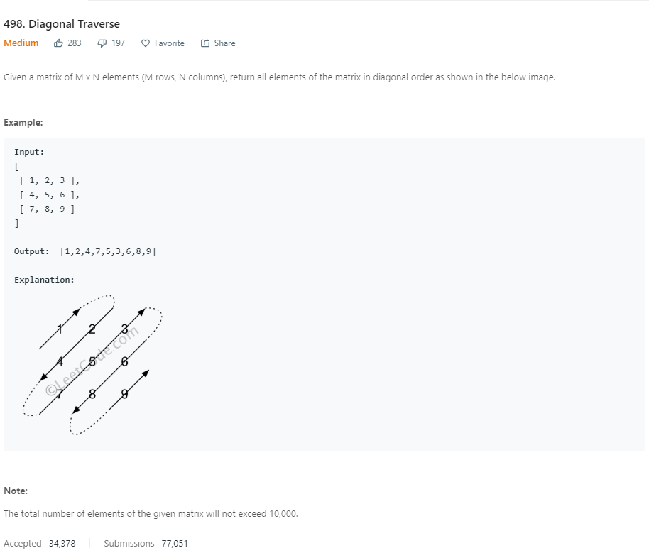

```java
public static int[] findDiagonalOrder(int[][] matrix) {
        if (matrix == null || matrix.length == 0) return new int[0];
        int m = matrix.length, n = matrix[0].length;

        int[] result = new int[m * n];
        int row = 0, col = 0, d = 0;
        int[][] dirs = {{-1, 1}, {1, -1}};

        for (int i = 0; i < m * n; i++) {
            result[i] = matrix[row][col];
            row += dirs[d][0];
            col += dirs[d][1];

            if (row >= m) {
                row = m - 1;
                col += 2;
                d = 1 - d;
            }
            if (col >= n) {
                col = n - 1;
                row += 2;
                d = 1 - d;
            }
            if (row < 0) {
                row = 0;
                d = 1 - d;
            }
            if (col < 0) {
                col = 0;
                d = 1 - d;
            }
        }

        return result;
    }
```
* 用***d=1-d***来控制方向，向下或者向上。
* 分为四种情况
1. 当col<0,即到左边界之外，则col=0就可以，row不变。并改变运动方向
2. 当row<0,即到达上边界，则row=0就可以，col不变，并改变运动方向
3. 当row>=m,即到达下边界，此时row=m-1,col+=2(因为col多减1)
4. 当col>=n,即到达有边界，此时 col = n - 1;row += 2，并改变运动方向