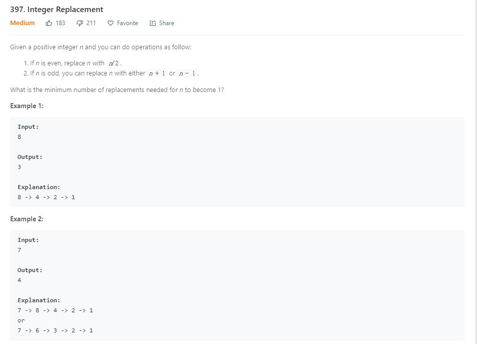

```java
 public int integerReplacement(int n) {
        Map<Integer, Integer> map = new HashMap<Integer, Integer>();
        //记忆化搜索
        map.put(1, 0);
        map.put(2, 1);

        return helper(n, map);
    }
    
    private int helper(int n, Map<Integer, Integer> map) {
        if (map.containsKey(n)) {
            return map.get(n);
        }
        
        int steps = -1;
        if (n % 2 == 0) {
            steps = helper(n / 2, map) + 1;
        } else {
            //为了避免n+1 overflow,所以1 + (n - 1) / 2
            steps = Math.min(helper((n - 1), map) + 1, helper(1 + (n - 1) / 2, map) + 2);
        }
        
        map.put(n, steps);
        
        return steps;
    }
```