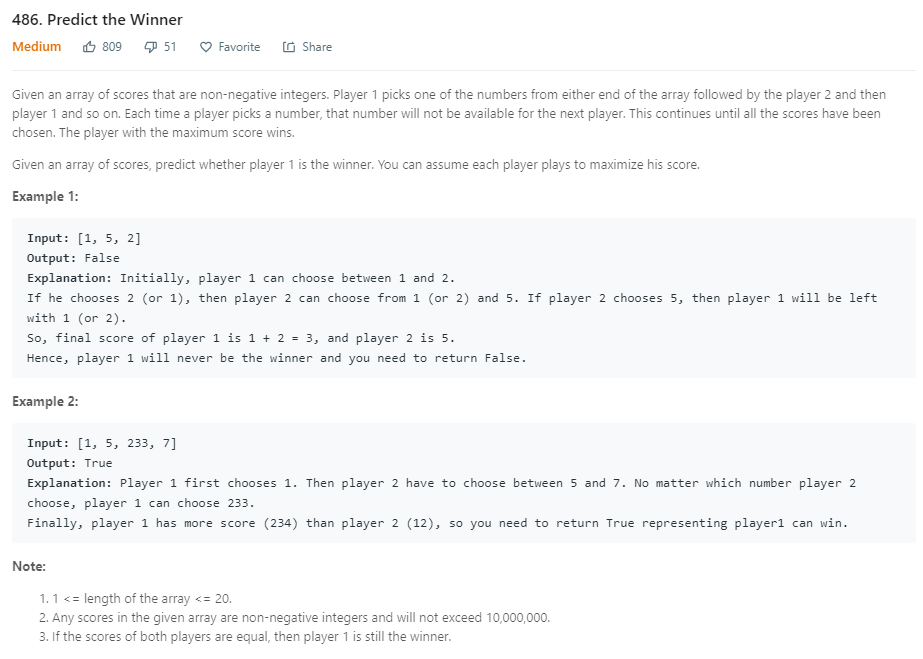

```java
    int mem[][];
    public boolean PredictTheWinner(int[] nums) {
        mem = new int[nums.length][nums.length];
        for(int i=0;i<nums.length;i++){
            for(int j=0;j<nums.length;j++){
                mem[i][j] = Integer.MIN_VALUE;
            }
        }
        return getMax(nums,0,nums.length-1)>=0;
    }

    public int getMax(int[]nums,int l,int r){
        if(l == r){
            return nums[l];
        }else{
            if(mem[l][r]!=Integer.MIN_VALUE){
                return mem[l][r];
            }
            mem[l][r] =  Math.max(nums[l]-getMax(nums,l+1,r),nums[r]-getMax(nums,l,r-1));
            return mem[l][r];
        }
    }
```
* 整个问题可以转化成down-to-top的思想，从最后一个pick开始，第一个人先挑选前面的，剩下的该另外一个人挑选。或者第一个人先挑选后面的，剩下的该另外一个人挑选。这样从底到最开始的时候，每次都挑选最大差值的一个。因为最后一定返回一个最优差值，只要判断这个最优值是否大于0，从而判断结果。
* 这里做一个优化，在迭代的时候，用到记忆化搜索，对于重复计算的部分，则用一个二维数组记录下，以后遇到相同的调用，就不用计算，直接返回。