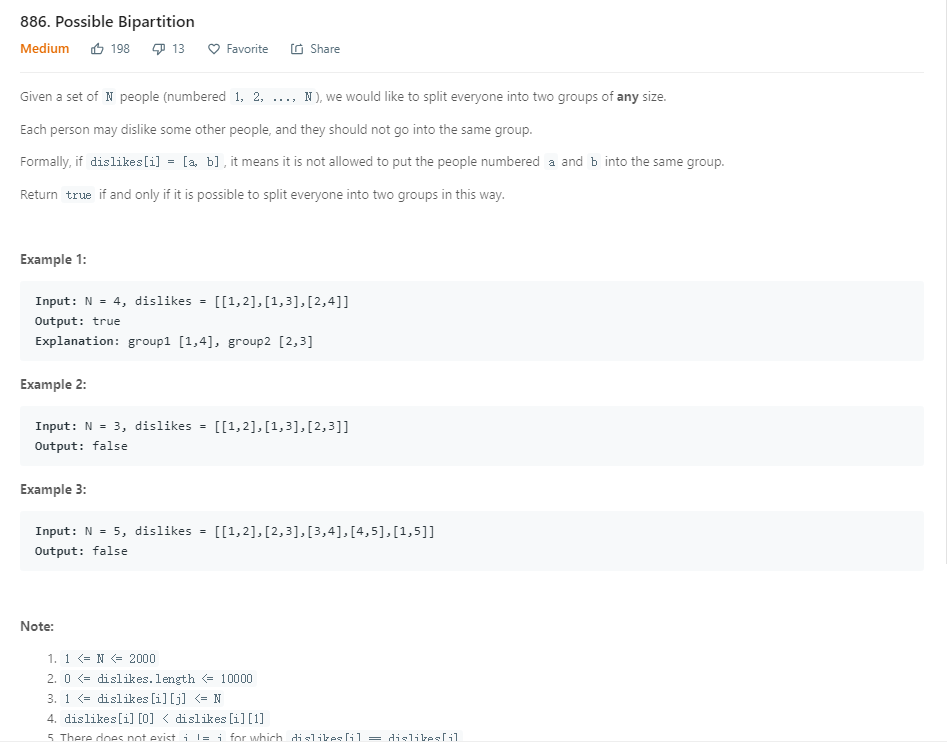

采用一个着色的思想，从一个顶点开始，dfs或者bfs。把与它相邻的顶点着相反的颜色。如果，邻居和它是相同的颜色，则说明不可能分成两个部分。如果dfs，bfs遍历完成，则说明可以分成两个部分。
```java
 public boolean possibleBipartition(int N, int[][] dislikes) {
        List<Integer>[] adjLists = new ArrayList[N];
        for (int i = 0; i < N; i++) {
            adjLists[i] = new ArrayList<>();
        }
        for (int[] pair : dislikes) {
            adjLists[pair[0] - 1].add(pair[1] - 1);
            adjLists[pair[1] - 1].add(pair[0] - 1);
        }

        int[] color = new int[N];
        for (int i = 0; i < N; i++) {
            if (color[i] == 0 && !bfs(adjLists, i, color)) return false;
        }

        return true;
    }

    private boolean bfs(List<Integer>[] adjLists, int s, int[] color) {
        Queue<Integer> q = new LinkedList<>();
        color[s] = 1;
        q.offer(s);
        while (!q.isEmpty()) {
            Integer v = q.poll();
            for (Integer neighbor : adjLists[v]) {
                if (color[neighbor] == 0) {
                    color[neighbor] = -color[v];
                    q.offer(neighbor);
                } else if (color[v] == color[neighbor]) {
                    return false;
                }
            }
        }
        return true;

    }
```