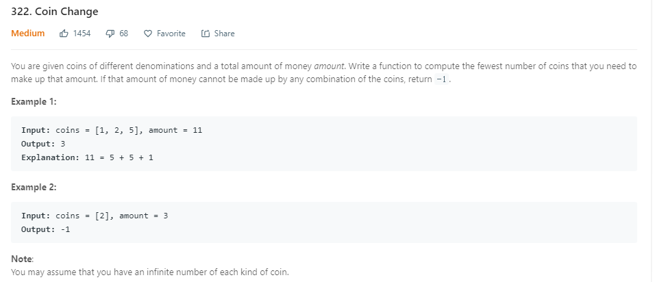

```java
public static int coinChange(int[] coins, int amount) {
        if (coins == null || coins.length == 0 || amount <= 0) {
            return 0;
        }
        int[] dp = new int[amount + 1];
        Arrays.fill(dp, Integer.MAX_VALUE);
        dp[0] = 0;
        for (int i = 0; i < coins.length; i++) {
            for (int j = 1; j <= amount; j++) {
                if (j - coins[i] >= 0 && dp[j - coins[i]] != Integer.MAX_VALUE) {
                    dp[j] = Math.min(dp[j], dp[j - coins[i]] + 1);
                }
            }
        }
        if (dp[amount] == Integer.MAX_VALUE) {
            return -1;
        }
        return dp[amount];
    }
```
* dp[j - coins[i]] != Integer.MAX_VALUE 注意这个判断，不然+1后会溢出。