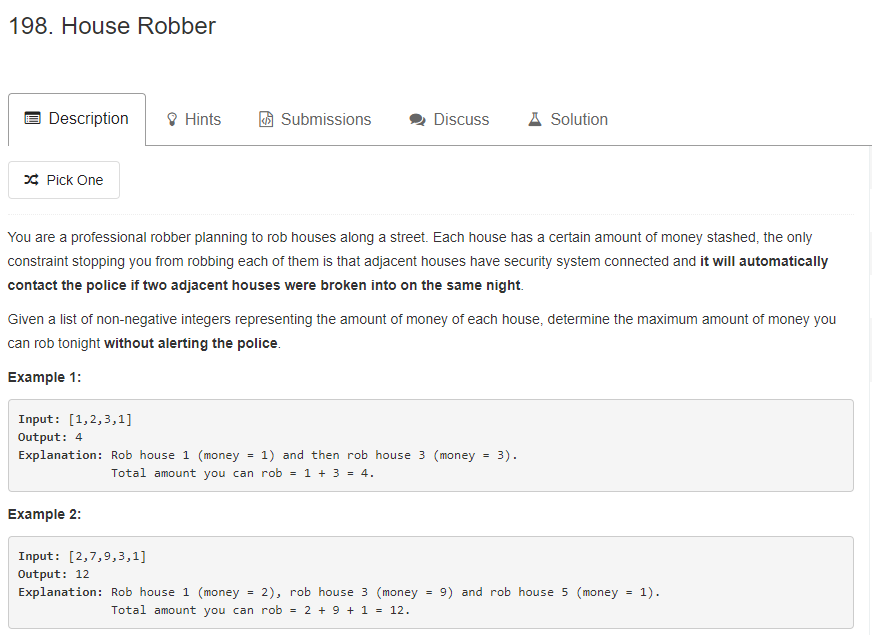

这道Dp问题的思路在于如何，任何位置的最大值一定是 它前面第二位置的最大值和他前面三个位置的最大值之间的最大值。因为都是正整数，所以rob的元素越多越好。
```java
public int rob(int[] nums) {
        if(nums.length==0){
            return 0;
        }
        if(nums.length==1){
            return nums[0];
        }
        int []dp = new int[nums.length];
        dp[0] = nums[0];
        dp[1] = nums[1];
        for(int i=2;i<nums.length;i++){
            int pre = dp[i-2];
            //考虑只有3个元素的情况
            if(i-3>=0){
                dp[i] = Math.max(pre,dp[i-3])+nums[i];
            }else{
                dp[i] = pre + nums[i];
            }
        }
        return Math.max(dp[nums.length-2],dp[nums.length-1]);
    }
```