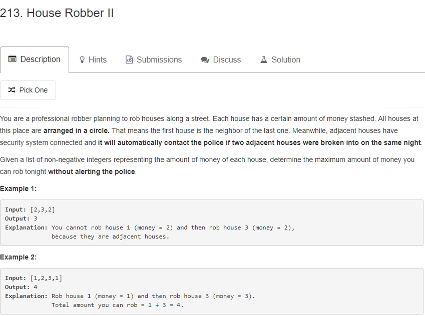

这道题的思路和houserrober的思路很相近，因为第一个房子和最后一个房子是相邻的，所以考虑的是（0，len-2）和（1，len-）这两个过程的最大值。houserrober也可以用这道题的思想来做，空间复杂度是O(1)。
```java
public int rob(int[] nums) {
            if (nums == null || nums.length == 0)
                return 0;
            int n = nums.length;
            if (n == 1) {
                return nums[0];
            }
            return Math.max(robHelper(nums, 0, n - 2), robHelper(nums, 1, n - 1));
        }
        
        private int robHelper(int[] nums, int start, int end) {
            int curr, prev, prev2;
            curr = prev = prev2 = 0;
            for (int i = start; i <= end; i++) {
                //每次保存到目前为止的最大值
                curr = Math.max(prev2 + nums[i], prev);
                prev2 = prev;
                prev = curr;
            }
            return curr;
        }
```