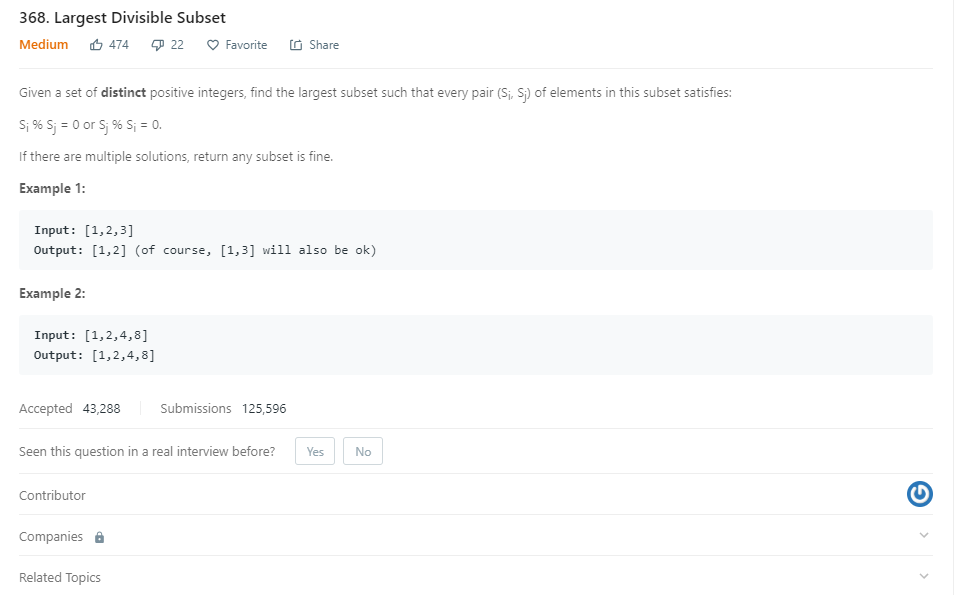

```java
public static List<Integer> largestDivisibleSubset(int[] nums) {
        int n = nums.length;
        int[] count = new int[n];
        int[] pre = new int[n];
        Arrays.sort(nums);
        int max = 0, index = -1;
        for (int i = 0; i < n; i++) {
            count[i] = 1;
            pre[i] = -1;
            for (int j = i - 1; j >= 0; j--) {
                if (nums[i] % nums[j] == 0) {
                    if (1 + count[j] > count[i]) {
                        count[i] = count[j] + 1;
                        pre[i] = j;
                    }
                }
            }
            if (count[i] > max) {
                max = count[i];
                index = i;
            }
        }
        List<Integer> res = new ArrayList<>();
        while (index != -1) {
            res.add(nums[index]);
            index = pre[index];
        }
        return res;
    }
```
* 这题和连续的递增序列很接近。DP解法
* count[i]保存的是以第i个元素为最后元素的subset里面元素的个数。
* pre[i] 以i元素为最后元素，他的前面一个元素的下标。
* 适合不是连续的子序列，最大值，最小值等