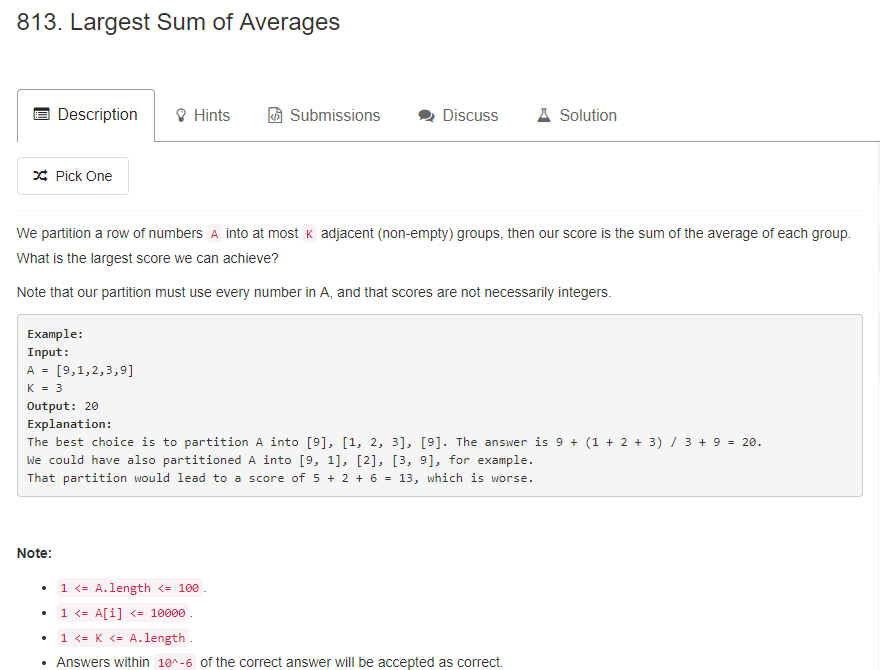

* 回溯法解，有些case会超时，但还是记录下来，供参考。当找不到好的办法的时候，这样的方法最直接，最暴力。
```java
static int [][]sum;
    static double max = 0;
    static double temp = 0;
    public static void main(String[] args) {
        System.out.println(largestSumOfAverages(new int[]{9,1,2,3,9},3));
    }

    public static double largestSumOfAverages(int[] A, int K) {
        if(A.length==0){
            return 0;
        }
        if(A.length==1){
            return A[0];
        }
        sum = new int[A.length+1][A.length+1];
        for(int i=1;i<=A.length;i++){
            for(int j=i;j<=A.length;j++){
                sum[i][j] = sum[i][j-1]+A[j-1];
            }
        }
        dfs(A,K,0,0);

        return max;
    }

    public static void dfs(int []A,int k,int start,int count){
        if(count<k-1){
            for(int i=0;i<A.length-1-start;i++){
                temp+=(double)sum[start+1][start+1+i]/(i+1);
                dfs(A,k,start+i+1,count+1);
                temp-=(double)sum[start+1][start+1+i]/(i+1);
            }
        }else{
            temp+=(double)sum[start+1][A.length]/(A.length-start);
            if(temp>max){
                max = temp;
            }
            temp-=(double)sum[start+1][A.length]/(A.length-start);
        }
    }
```

* Dp解法，地推公式为dp[i][k] = Math.max(dp[i][k], dp[j][k - 1] + (double) (sum[i] - sum[j]) / (i - j));表示前j个元素分成k-1组，后（i-j)形成一组。这样不断形成子问题。直到最后dp[A.length][K]就是最大值
```java
public static double largestSumOfAverages(int[] A, int K) {
        //dp[j][k]表示j个元素分成k组的最大平均值
        double[][] dp = new double[A.length + 1][K+1];
        int[] sum = new int[A.length+1];
        for (int i = 1; i <=A.length; i++) {
            sum[i] = sum[i - 1] + A[i-1];
            //计算baseline
            dp[i][1] = (double)sum[i] / i;
        }
        //分为k组,k=1为baseline已经计算
        for (int k = 2; k <= K; k++) {
            //至少k个元素
            for (int i = k; i <= A.length; i++) {
                //循环寻找分界点j，这个分界点把前i个元素一分为二
                for (int j = k-1; j < i; j++) {
                    //前j个元素分成k-1组，后（i-j)形成一组
                    dp[i][k] = Math.max(dp[i][k], dp[j][k - 1] + (double) (sum[i] - sum[j]) / (i - j));
                }
            }
        }

        return dp[A.length][K];

    }
```