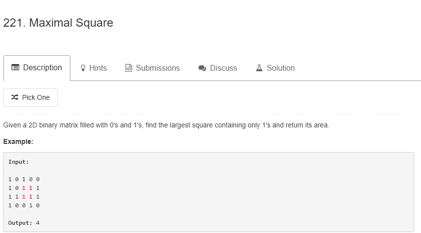

思路：这是一道dp问题，以（i,j)为右下角构成正方形，那么它的上边，左边，左上边也必然是被包含在正方形内，此时以（i,j）以（i,j)为右下角构成正方形依赖于上边，左边，左上边中最小的边。此时的递推公式为
dp[i][j] = Math.min(dp[i - 1][j], Math.min(dp[i][j - 1], dp[i - 1][j - 1])) + 1;

```java
 public int maximalSquare(char[][] matrix) {

        if (matrix == null || matrix.length == 0) {
            return 0;
        }

        int rows = matrix.length;
        int columns = matrix[0].length;
        //dp数组保存的是[i][j]坐标处能够成正方形的最大值
        int[][] dp = new int[rows][columns];
        //保存最大边
        int len = 0;
        //初始化第一行
        for (int i = 0; i < rows; i++) {
            dp[i][0] = matrix[i][0] - '0';
            len = Math.max(len, dp[i][0]);
        }
        //初始化第一列
        for (int j = 0; j < columns; j++) {
            dp[0][j] = matrix[0][j] - '0';
            len = Math.max(len, dp[0][j]);
        }
        for (int i = 1; i < rows; i++) {
            for (int j = 1; j < columns; j++) {
                if (matrix[i][j] - '0' == 0) {
                    dp[i][j] = 0;
                } else {
                    dp[i][j] = Math.min(dp[i - 1][j], Math.min(dp[i][j - 1], dp[i - 1][j - 1])) + 1;
                    len = Math.max(len, dp[i][j]);
                }
            }
        }

        return len * len;
    }
```