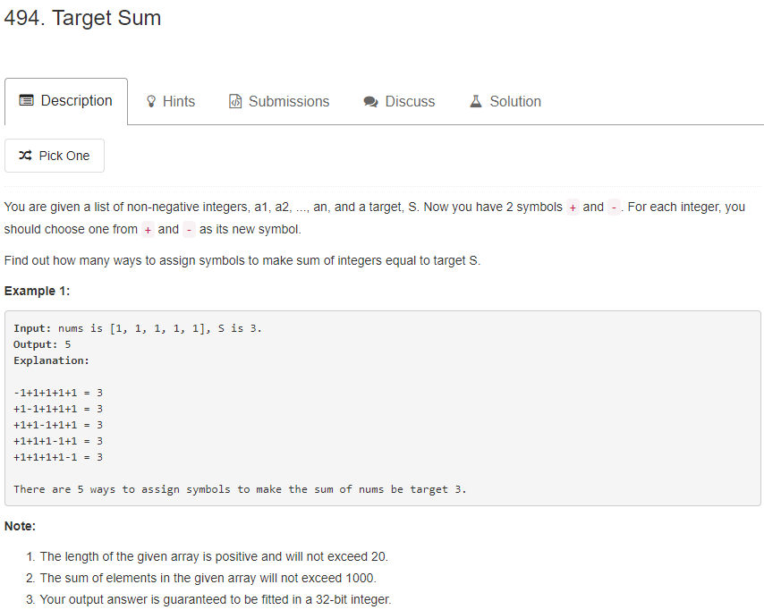

#### 1. DFS枚举出每种情况
```java
   int result = 0;
   //true代表+，false代表-
   boolean []sign = new boolean[]{true,false};
    
   public  int findTargetSumWays(int[] nums, int S) {
        dfs(nums,S,0,0);
        return result;
    }

    public  void dfs(int []nums,int s,int sum,int count){
        if(count<nums.length){
            for(int i=0;i<2;i++){
                if(sign[i]){
                    sum+=nums[count];
                }else{
                    sum-=nums[count];
                }
                dfs(nums,s,sum,count+1);
                if(sign[i]){
                    sum-=nums[count];
                }else{
                    sum+=nums[count];
                }
            }
        }else{
            if(sum==s){
                result++;
            }
        }

    }
```

#### 2. DP解决
dp[i][j] = dp[i-1][j-nums[i-1]]||dp[i-1][j+nums[i-1]](考虑正负的两种情况)  （前i个元素和为j的方式有多少种）
```java
 public static int findTargetSumWays(int[] nums, int S) {
        int sum = 0;
        for(int i=0;i<nums.length;i++){
            sum += nums[i];
        }
        //剪枝
        if(S>sum||S<-sum){
            return 0;
        }
        //S的范围在[-sum,sum],所以开辟的数组为如下
        int[][] dp = new int[nums.length+1][sum*2+1];
        dp[0][0+sum] = 1;
        for(int i=1;i<=nums.length;i++){
            for(int j=0;j<=sum*2;j++){
                int n = 0;
                if (j-nums[i-1]>=0){
                    n+=dp[i-1][j-nums[i-1]];
                }
                if (j+nums[i-1]<=2*sum){
                    n+=dp[i-1][j+nums[i-1]];
                }
                dp[i][j] = n;
            }
        }
        return dp[nums.length][S+sum];
    }
```
#### 3. 巧妙的DP
>sum(P) - sum(N) = target
 sum(P) + sum(N) + sum(P) - sum(N) = target + sum(P) + sum(N)
 2 * sum(P) = target + sum(nums)
 Let P be the positive subset and N be the negative subset

dp[i][j] = dp[i - 1][j] + dp[i - 1][j - nums[i - 1]]||dp[i - 1][j]  （前i个元素和为j的方式有多少种）
这个问题等价于找出一个几个数和为sum+S.
```java
public static int findTargetSumWays(int[] nums, int S) {
        int sum = 0;
        for (int i = 0; i < nums.length; i++) {
            sum += nums[i];
        }

        if (((S + sum) & 1) == 1 || ((S + sum) >>> 1) > sum) {
            return 0;
        }

        int target = (S + sum) >>> 1;
        int[][] dp = new int[nums.length + 1][target + 1];
        for (int i = 0; i <= nums.length; i++) {
            dp[i][0] = 1;
        }

        for (int i = 1; i <= nums.length; ++i) {
            for (int j = 0; j<= target; j++) {
                if(j-nums[i-1]>=0) {
                    dp[i][j] = dp[i - 1][j] + dp[i - 1][j - nums[i - 1]];
                }else{
                    dp[i][j] = dp[i - 1][j];
                }
            }
        }
        return dp[nums.length][target];
    }
```