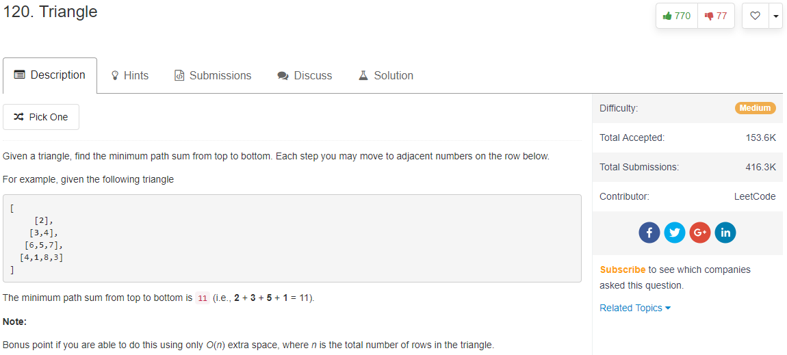

这是一道Dp问题，这里采用的是从下往上数，每次都保存最小的，那么最后，最上面的那个一定是最短路径。
```java
ublic int minimumTotal(List<List<Integer>> triangle) {
        int dp[] = new int[triangle.size()];
        if(triangle.size()==1){
            return triangle.get(0).get(0);
        }
        for(int i=0;i<triangle.get(triangle.size()-1).size();i++){
            dp[i] = triangle.get(triangle.size()-1).get(i);
        }
        for(int i=triangle.size()-2;i>=0;i--){
            for(int j=0;j<triangle.get(i).size();j++){
                dp[j] = Math.min(dp[j],dp[j+1])+triangle.get(i).get(j);
            }
        }
        return dp[0];
    }
```