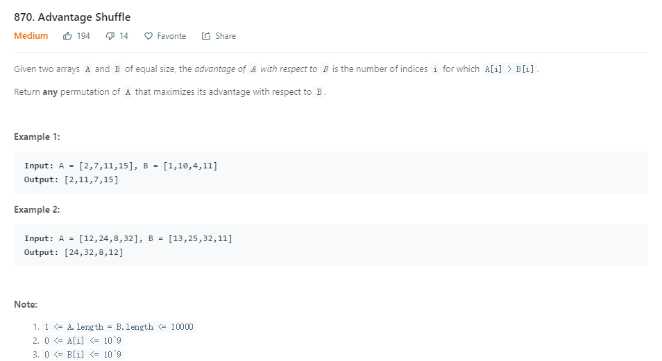

这是一道用贪心解法的题目。
每次根据B中的数，到A选择一个刚好比它大一点的，如果找不到，则选择最小的那个去抵消它，这是一种田忌赛马的做法。这里正好可以用TreeMap去实现。
```java
public static int[] advantageCount(int[] A, int[] B) {
        TreeMap<Integer, Integer> map = new TreeMap<>();
        for(int a : A) {
            map.put(a, map.getOrDefault(a, 0) + 1);
        }
        int[] res = new int[A.length];
        int index = 0;
        for(int b : B) {
            Integer higher = map.higherKey(b);
            //如果找到一个比b刚好大的，则就选
            if(higher != null) {
                int freq = map.get(higher);
                if(freq == 1) map.remove(higher);
                else map.put(higher, freq-1);
                res[index++] = higher;
            }else{
                //否则选择一个最小的
                Integer first = map.firstKey();
                int freq = map.get(first);
                if(freq == 1) map.remove(first);
                else map.put(first, freq-1);
                res[index++] = first;
            }
        }
        return res;
    }
```

