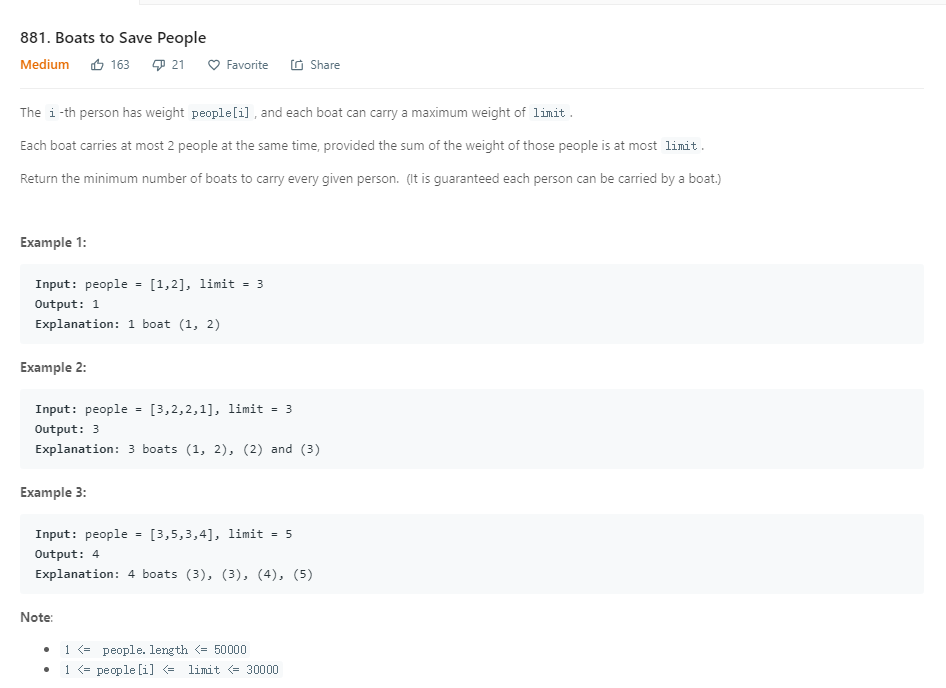

这道题目主要是贪心算法，每次尽量把最小和最大的配对。如果不能配对，则较大的只能单独一条船
```java
 public int numRescueBoats(int[] people, int limit) {
        Arrays.sort(people);
        int count = 0;
        int start = 0;
        int end = people.length-1;
        while (end >= start) {
            if (people[start] + people[end] <= limit) {
                //最开始一个就可以和最后一个配对坐同一条船
                start++;
            }
            end--;
            count++;
        }
        
        return count;
    }
```