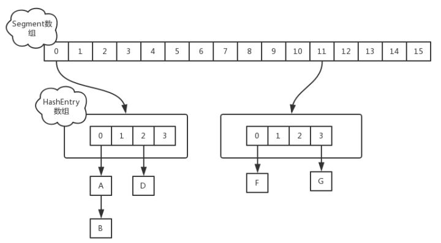
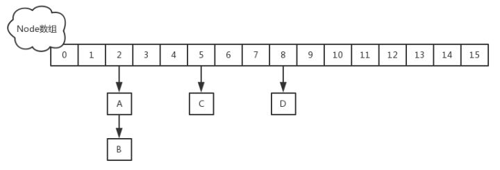

#### ConcurrentHashMap在1.7的实现
采用的Segment+HashEntry(链表)的方式。Segment继承于ReentrantLock，所以每次并发的数量是Segment的数量。如下


#### ConcurrentHashMap在1.8的实现
采用的是Sychronized+Cas+Node(链表或红黑树)的方式。这样的并发粒度更细了，所以每次并发的数量是Table数组的长度。


##### 源码分析
* 基础的数据结构
```java
static class Node<K,V> implements Map.Entry<K,V> {
        final int hash;
        final K key;
        volatile V val;
        volatile Node<K,V> next;
}
    //hash的取值和意义如下
    static final int MOVED     = -1; // hash for forwarding nodes
    static final int TREEBIN   = -2; // hash for roots of trees
    static final int RESERVED  = -3; // hash for transient reservations
    static final int HASH_BITS = 0x7fffffff; // usable bits of normal node hash

    //扩容时，将table中的元素迁移至nextTable . 扩容时非空
    private transient volatile Node<K,V>[] nextTable;

    //表示已经分配给扩容线程的table数组索引位置
    private transient volatile int transferIndex;

    //扩容线程每次最少要迁移16个hash桶
    private static final int MIN_TRANSFER_STRIDE = 16;
```

```java
private transient volatile int sizeCtl;
```
多线程之间，以volatile的方式读取sizeCtl属性，来判断ConcurrentHashMap当前所处的状态。通过cas设置sizeCtl属性，告知其他线程ConcurrentHashMap的状态变更。不同状态，sizeCtl所代表的含义也有所不同。
>未初始化：sizeCtl=0：表示没有指定初始容量。sizeCtl>0：表示初始容量。
初始化中：sizeCtl=-1,标记作用，告知其他线程，正在初始化。
正常状态： sizeCtl=0.75n ,扩容阈值
扩容中:sizeCtl < 0 : 表示有其他线程正在执行扩容，sizeCtl = (resizeStamp(n) << RESIZE_STAMP_SHIFT) + 2 :表示此时只有一个线程在执行扩容

##### 构造方法
```java
 public ConcurrentHashMap(int initialCapacity) {
        if (initialCapacity < 0)
            throw new IllegalArgumentException();
        //确保cap是2的幂，且比initialCapacity刚刚大的2的n次幂，例如给9，返回16，给16 返回32
        int cap = ((initialCapacity >= (MAXIMUM_CAPACITY >>> 1)) ?
                   MAXIMUM_CAPACITY :
                   tableSizeFor(initialCapacity + (initialCapacity >>> 1) + 1));
        this.sizeCtl = cap;
    }
```
* 构造函数的时候并没有真正的初始化map,只是确定一个容量。真正的初始化等到put()的时候。

##### put方法
```java
public V put(K key, V value) {
        return putVal(key, value, false);
    }

final V putVal(K key, V value, boolean onlyIfAbsent) {
        if (key == null || value == null) throw new NullPointerException();
        int hash = spread(key.hashCode());
        int binCount = 0;
        for (Node<K,V>[] tab = table;;) {
            Node<K,V> f; int n, i, fh;
            //若还没初始化则初始化。
            if (tab == null || (n = tab.length) == 0)
                tab = initTable();
            //如果table中该位置为null,则Cas放入进去
            else if ((f = tabAt(tab, i = (n - 1) & hash)) == null) {
                if (casTabAt(tab, i, null,
                             new Node<K,V>(hash, key, value, null)))
                    break;                   // no lock when adding to empty bin
            }
            //若正在扩容，则帮助扩容
            else if ((fh = f.hash) == MOVED)
                tab = helpTransfer(tab, f);
            else {
                V oldVal = null;
                //否认hash冲突，则遍历链表或者红黑树，放到合适的位置
                synchronized (f) {
                    if (tabAt(tab, i) == f) {
                        if (fh >= 0) {
                            binCount = 1;
                            for (Node<K,V> e = f;; ++binCount) {
                                K ek;
                                //如果已经存在旧值，则替换
                                if (e.hash == hash &&
                                    ((ek = e.key) == key ||
                                     (ek != null && key.equals(ek)))) {
                                    oldVal = e.val;
                                    if (!onlyIfAbsent)
                                        e.val = value;
                                    break;
                                }
                                Node<K,V> pred = e;
                                //找到末尾的节点，插入后面。
                                if ((e = e.next) == null) {
                                    pred.next = new Node<K,V>(hash, key,
                                                              value, null);
                                    break;
                                }
                            }
                        }
                        //如果是红黑树，则放到红黑树相应的位置
                        else if (f instanceof TreeBin) {
                            Node<K,V> p;
                            binCount = 2;
                            if ((p = ((TreeBin<K,V>)f).putTreeVal(hash, key,
                                                           value)) != null) {
                                oldVal = p.val;
                                if (!onlyIfAbsent)
                                    p.val = value;
                            }
                        }
                    }
                }
                if (binCount != 0) {
                    //如果达到转红黑树的阈值，则转红黑树
                    if (binCount >= TREEIFY_THRESHOLD)
                        treeifyBin(tab, i);
                    if (oldVal != null)
                        return oldVal;
                    break;
                }
            }
        }
        //增加计数
        addCount(1L, binCount);
        return null;
    }
```
插入(key,value)的逻辑如下：
1. 如果没初始化，则调用initTable()初始化。
2. 如果table[i]这个位置为null,则CAS直接插入。
3. 如果不为null,则判断是否在扩容。如果在扩容，则帮助扩容。
4. 如果不在扩容，判断节点类型，如果是Node类型，则遍历链表，找到合适位置插入。如果这个key已经存在，则替换。
5. 如果是红黑树节点类型，则遍历红黑树，找到合适位置插入。如果这个key已经存在，则替换。
6. 增加计数

##### 如何计数
```java
private final void addCount(long x, int check) {
        CounterCell[] as; long b, s;
        //没有竞争的情况下，直接更新basecount就行 否则用CounterCell记录
        if ((as = counterCells) != null ||
            !U.compareAndSwapLong(this, BASECOUNT, b = baseCount, s = b + x)) {
            CounterCell a; long v; int m;
            boolean uncontended = true;
            //往as里面存储
            if (as == null || (m = as.length - 1) < 0 ||
                (a = as[ThreadLocalRandom.getProbe() & m]) == null ||
                !(uncontended =
                  U.compareAndSwapLong(a, CELLVALUE, v = a.value, v + x))) {
                //CAS失败，下面这个函数保障添加成功
                fullAddCount(x, uncontended);  //保证添加成功
                return;
            }
            if (check <= 1)
                return;
            s = sumCount();
        }
        //看是否还需要扩容
        if (check >= 0) {
            Node<K,V>[] tab, nt; int n, sc;
            while (s >= (long)(sc = sizeCtl) && (tab = table) != null &&
                   (n = tab.length) < MAXIMUM_CAPACITY) {
                int rs = resizeStamp(n);
                if (sc < 0) {
                    if ((sc >>> RESIZE_STAMP_SHIFT) != rs || sc == rs + 1 ||
                        sc == rs + MAX_RESIZERS || (nt = nextTable) == null ||
                        transferIndex <= 0)
                        break;
                    if (U.compareAndSwapInt(this, SIZECTL, sc, sc + 1))
                        transfer(tab, nt);
                }
                else if (U.compareAndSwapInt(this, SIZECTL, sc,
                                             (rs << RESIZE_STAMP_SHIFT) + 2))
                    transfer(tab, null);
                s = sumCount();
            }
        }
    }
```
跟更新数目的步骤如下：
1. CAS更新baseCount
2. 第1步更新失败，则CAS更新CounterCell数组
3. 第2步更新失败则通过fullAddCount()保证添加在CounterCell中
4. 还要再检查一遍是否还需要扩容

调用size()的源码
```java
public int size() {
        long n = sumCount();
        return ((n < 0L) ? 0 :
                (n > (long)Integer.MAX_VALUE) ? Integer.MAX_VALUE :
                (int)n);
    }

final long sumCount() {
        CounterCell[] as = counterCells; CounterCell a;
        long sum = baseCount;
        if (as != null) {
            for (int i = 0; i < as.length; ++i) {
                if ((a = as[i]) != null)
                    sum += a.value;
            }
        }
        return sum;
    }
```
总的size=baseCount+CounterCell里面值。

##### 扩容的实现
```java
private final void transfer(Node<K,V>[] tab, Node<K,V>[] nextTab) {
        int n = tab.length, stride;
        //将 length / 8 然后除以 CPU核心数。如果得到的结果小于 16，那么就使用 16。最小16
        if ((stride = (NCPU > 1) ? (n >>> 3) / NCPU : n) < MIN_TRANSFER_STRIDE)
            stride = MIN_TRANSFER_STRIDE; // subdivide range
        if (nextTab == null) {            // initiating
            try {
                @SuppressWarnings("unchecked")
                //构造一个容量是原来2倍的数组
                Node<K,V>[] nt = (Node<K,V>[])new Node<?,?>[n << 1];
                // 更新
                nextTab = nt;
            } catch (Throwable ex) {      // try to cope with OOME
                sizeCtl = Integer.MAX_VALUE;
                return;
            }
            //把nextTable指向nt
            nextTable = nextTab;
            //把扩容桶的索引指向最后，从后往前复制。
            transferIndex = n;
        }
        int nextn = nextTab.length;
        // 创建一个 fwd 节点，用于占位。当别的线程发现这个槽位中是 fwd 类型的节点，则跳过这个节点。表示这个节点扩容完毕
        ForwardingNode<K,V> fwd = new ForwardingNode<K,V>(nextTab);
        // 首次推进为 true，如果等于 true，说明需要再次推进一个下标（i--），反之，如果是 false，那么就不能推进下标，需要将当前的下标处理完毕才能继续推进
        boolean advance = true;
        //标志扩容是否完毕
        boolean finishing = false; // to ensure sweep before committing nextTab
        //这个死循环开始扩容
        for (int i = 0, bound = 0;;) {
            Node<K,V> f; int fh;
            //每个线程找到扩容的范围，上界nextIndex，下界bound。
            while (advance) {
                int nextIndex, nextBound;
                if (--i >= bound || finishing)
                    advance = false;
                //扩容的范围分配完毕，跳出循环
                else if ((nextIndex = transferIndex) <= 0) {
                    i = -1;
                    advance = false;
                }
                //Cas获取范围
                else if (U.compareAndSwapInt
                         (this, TRANSFERINDEX, nextIndex,
                          nextBound = (nextIndex > stride ?
                                       nextIndex - stride : 0))) {
                    bound = nextBound;
                    i = nextIndex - 1;
                    advance = false;
                }
            }
            //此时的i指向范围的上界
            if (i < 0 || i >= n || i + n >= nextn) {
                int sc;
                //扩容完毕，清除一些变量
                if (finishing) {
                    nextTable = null;
                    table = nextTab;
                    sizeCtl = (n << 1) - (n >>> 1);
                    return;
                }
                if (U.compareAndSwapInt(this, SIZECTL, sc = sizeCtl, sc - 1)) {
                    if ((sc - 2) != resizeStamp(n) << RESIZE_STAMP_SHIFT)
                        return;
                    finishing = advance = true;
                    i = n; // recheck before commit
                }
            }
            else if ((f = tabAt(tab, i)) == null)  //获取老 tab i 下标位置的变量，如果是 null，就使用 fwd 占位。
                advance = casTabAt(tab, i, null, fwd); //如果成功写入 fwd 占位，再次推进一个下标
            else if ((fh = f.hash) == MOVED) //已经处理了，推进一个下标
                advance = true; // already processed
            else {
                //锁住头节点，复制。(避免复制的时候插入节点)
                synchronized (f) {
                    if (tabAt(tab, i) == f) {
                        //定义地位链表，高位链表。与HashMap类似。要么在原来位置，要么在原来位置+旧的容量位置。
                        Node<K,V> ln, hn;
                        if (fh >= 0) {
                            int runBit = fh & n; 
                            Node<K,V> lastRun = f;
                            //获取最后一个runBit，lastRun不变的位置。
                            for (Node<K,V> p = f.next; p != null; p = p.next) {
                                int b = p.hash & n;
                                if (b != runBit) {
                                    runBit = b;
                                    lastRun = p;
                                }
                            }
                            //此时lastRun记录的是最后一个hash值变化的Node，下面会有解释。
                            if (runBit == 0) {
                                ln = lastRun;
                                hn = null;
                            }
                            else {
                                hn = lastRun;
                                ln = null;
                            }
                            //以上的if,else.把lastRun节点变为ln,hn的首节点
                            for (Node<K,V> p = f; p != lastRun; p = p.next) {
                                int ph = p.hash; K pk = p.key; V pv = p.val;
                                //头插法插入进去，反转了链表
                                if ((ph & n) == 0)
                                    ln = new Node<K,V>(ph, pk, pv, ln);
                                else
                                    hn = new Node<K,V>(ph, pk, pv, hn);
                            }
                            //放在新的table对应的位置
                            setTabAt(nextTab, i, ln);
                            setTabAt(nextTab, i + n, hn);
                            //设置该节点扩容完毕
                            setTabAt(tab, i, fwd);
                            //索引可以开始移到下一个位置了
                            advance = true;
                        }
                        //如果节点是树节点
                        else if (f instanceof TreeBin) {
                            TreeBin<K,V> t = (TreeBin<K,V>)f;
                            TreeNode<K,V> lo = null, loTail = null;
                            TreeNode<K,V> hi = null, hiTail = null;
                            int lc = 0, hc = 0;
                            for (Node<K,V> e = t.first; e != null; e = e.next) {
                                int h = e.hash;
                                TreeNode<K,V> p = new TreeNode<K,V>
                                    (h, e.key, e.val, null, null);
                                if ((h & n) == 0) {
                                    if ((p.prev = loTail) == null)
                                        lo = p;
                                    else
                                        loTail.next = p;
                                    loTail = p;
                                    ++lc;
                                }
                                else {
                                    if ((p.prev = hiTail) == null)
                                        hi = p;
                                    else
                                        hiTail.next = p;
                                    hiTail = p;
                                    ++hc;
                                }
                            }
                            //决定是把链表转化成红黑树，还是红黑树退化成链表
                            ln = (lc <= UNTREEIFY_THRESHOLD) ? untreeify(lo) :
                                (hc != 0) ? new TreeBin<K,V>(lo) : t;
                            hn = (hc <= UNTREEIFY_THRESHOLD) ? untreeify(hi) :
                                (lc != 0) ? new TreeBin<K,V>(hi) : t;
                            //把树放到新的table中    
                            setTabAt(nextTab, i, ln);
                            setTabAt(nextTab, i + n, hn);
                            setTabAt(tab, i, fwd);
                            advance = true;
                        }
                    }
                }
            }
        }
    }
```
>lastRun:默认值为当前位置第一个Node，经过第一次循环，lastRun记录的是最后一个hash值变化的Node。
runBit:位置为每个节点的hash值与n进行与操作，经过第一次循环，runBit记录的是最后一个hash值变化的Node的hash值。

举个例子：

如上图，6是最后一个hash值不发生变化的节点，lastRun也是指向6这个Node。runBit也是节点6与n进行与操作得到的值。因为在6之后，节点类型没有再变了。（这样设计的思路在于加快扩容速度，LastRun后面的可以直接拿过来，扩容之后也跟6属于同一个链表，而不用判断，属于这一段的节点也不用反转）

扩容的思路如下：
1. 得到每个线程可以处理的桶的数量。
2. 初始化临时变量 nextTable。将其在原有基础上扩容两倍。
3. Cas获取索引值，以及复制的上界和下界。
4. 如果节点是链表类型，则根据高位&n形成两个链表，放到新的table两个位置。
5. 如果节点是树节点类型，也采用和链表的方法，形成两个红黑树，放到新table相应的位置。
6. 把size+1;

##### get的实现
```java
 public V get(Object key) {
        Node<K,V>[] tab; Node<K,V> e, p; int n, eh; K ek;
        int h = spread(key.hashCode());
        //如果存在且第一个节点就是，直接返回
        if ((tab = table) != null && (n = tab.length) > 0 &&
            (e = tabAt(tab, (n - 1) & h)) != null) {
            if ((eh = e.hash) == h) {
                if ((ek = e.key) == key || (ek != null && key.equals(ek)))
                    return e.val;
            }
            //如果正在扩容，说明这个节点复制完毕或者是TreeBin，则通过find获取。
            else if (eh < 0)
                return (p = e.find(h, key)) != null ? p.val : null;
            //遍历链表获取
            while ((e = e.next) != null) {
                if (e.hash == h &&
                    ((ek = e.key) == key || (ek != null && key.equals(ek))))
                    return e.val;
            }
        }
        return null;
    }
```
get的逻辑如下:

1. table数组指定位置的第一个节点就匹配成功，直接返回；
2. table数组指定位置上的hash值小于0，此时当前位置可能已经被其他在扩容时处理过，或者当前位置的Node为一个TreeBin，不管是那种类型的Node，调用的都是find方法来获取Node节点；
3. 其余情况下，直接遍历链表查找。


参考文章
https://juejin.im/post/5b00160151882565bd2582e0
https://juejin.im/post/5ae75584f265da0b873a4810
https://juejin.im/post/5b19f130f265da6e3029acf5
