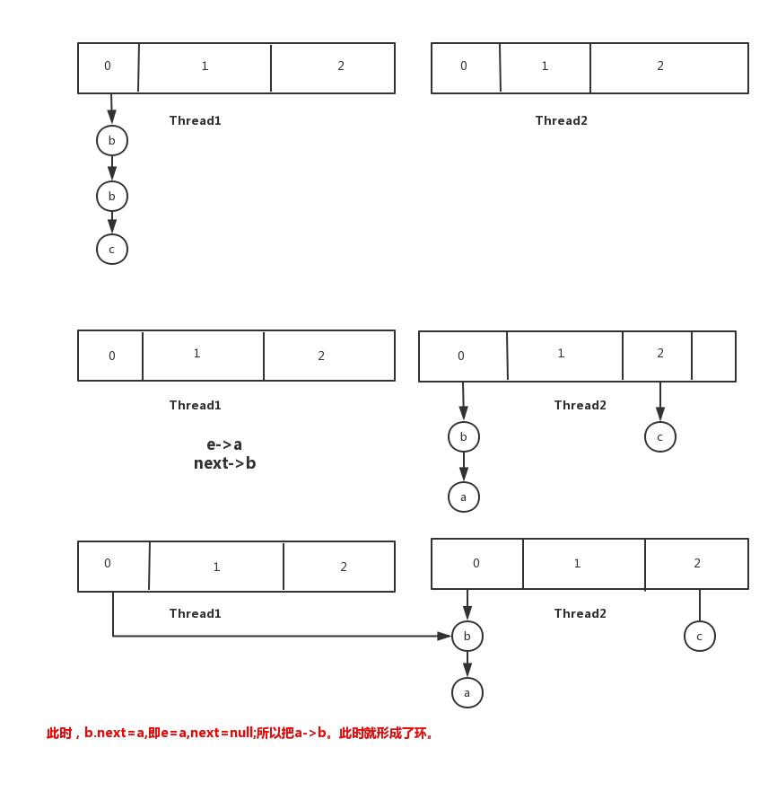

### 1. HashMap的实现
 
 //默认容量，初始化的时候始终保证容量是2的n次方
static final int DEFAULT_INITIAL_CAPACITY = 1 << 4; // aka 16

static final float DEFAULT_LOAD_FACTOR = 0.75f;

//转化成红黑树的阈值
static final int TREEIFY_THRESHOLD = 8;

//红黑树退化成链表的阈值
static final int UNTREEIFY_THRESHOLD = 6;

```java
//利用高16位和低16位做与或
static final int hash(Object key) {
        int h;
        return (key == null) ? 0 : (h = key.hashCode()) ^ (h >>> 16);
    }
```

* put 操作
```java
public V put(K key, V value) {
        return putVal(hash(key), key, value, false, true);
    }

     final V putVal(int hash, K key, V value, boolean onlyIfAbsent,
                   boolean evict) {
        Node<K,V>[] tab; Node<K,V> p; int n, i;
        if ((tab = table) == null || (n = tab.length) == 0)
        	//没有初始化，则初始化。
            n = (tab = resize()).length;
        if ((p = tab[i = (n - 1) & hash]) == null)
        	//这个位置位null,则直接构建结点插入
            tab[i] = newNode(hash, key, value, null);
        else {
            Node<K,V> e; K k;
            if (p.hash == hash &&
                ((k = p.key) == key || (key != null && key.equals(k))))
                e = p;
            //如果是TreeNode，则按Tree的方式插入
            else if (p instanceof TreeNode)
                e = ((TreeNode<K,V>)p).putTreeVal(this, tab, hash, key, value);
            else {
                for (int binCount = 0; ; ++binCount) {
                	//找到链表的结尾还没找到相同的key
                    if ((e = p.next) == null) {
                    	//则放入链表中
                        p.next = newNode(hash, key, value, null);
                        if (binCount >= TREEIFY_THRESHOLD - 1) // -1 for 1st
                        	//如果达到阈值，则转化成树
                            treeifyBin(tab, hash);
                        break;
                    }
                    //找到存在的key,则break;
                    if (e.hash == hash &&
                        ((k = e.key) == key || (key != null && key.equals(k))))
                        break;
                    p = e;
                }
            }
            //如果已经存在，则替换
            if (e != null) { // existing mapping for key
                V oldValue = e.value;
                if (!onlyIfAbsent || oldValue == null)
                    e.value = value;
                afterNodeAccess(e);
                return oldValue;
            }
        }
        ++modCount;
        //插入后大于阈值，则扩容
        if (++size > threshold)
            resize();
        afterNodeInsertion(evict);
        return null;
    }

    //扩容逻辑
    final Node<K,V>[] resize() {
        Node<K,V>[] oldTab = table;
        int oldCap = (oldTab == null) ? 0 : oldTab.length;
        int oldThr = threshold;
        int newCap, newThr = 0;
        if (oldCap > 0) {
        	//如果旧容量的已经达到最大容量
            if (oldCap >= MAXIMUM_CAPACITY) {
                threshold = Integer.MAX_VALUE;
                return oldTab;
            }
            //新的容量扩大到原来的两倍
            else if ((newCap = oldCap << 1) < MAXIMUM_CAPACITY &&
                     oldCap >= DEFAULT_INITIAL_CAPACITY)
                newThr = oldThr << 1; // double threshold
        }
        else if (oldThr > 0) // initial capacity was placed in threshold
        	如果大于0，则保持不变
            newCap = oldThr;
        else {               // zero initial threshold signifies using defaults
        	//如果为null,则为默认
            newCap = DEFAULT_INITIAL_CAPACITY;
            newThr = (int)(DEFAULT_LOAD_FACTOR * DEFAULT_INITIAL_CAPACITY);
        }
        if (newThr == 0) {
            float ft = (float)newCap * loadFactor;
            newThr = (newCap < MAXIMUM_CAPACITY && ft < (float)MAXIMUM_CAPACITY ?
                      (int)ft : Integer.MAX_VALUE);
        }
        threshold = newThr;
        //开辟数组
        @SuppressWarnings({"rawtypes","unchecked"})
            Node<K,V>[] newTab = (Node<K,V>[])new Node[newCap];
        table = newTab;
        if (oldTab != null) {
            for (int j = 0; j < oldCap; ++j) {
                Node<K,V> e;
                if ((e = oldTab[j]) != null) {
                	//赋值位null,有利于GC
                    oldTab[j] = null;
                    //如果该位置位null,直接插入就行
                    if (e.next == null)
                        newTab[e.hash & (newCap - 1)] = e;
                    //如果这个节点是红黑树，则插入节点涉及红黑树的分裂
                    else if (e instanceof TreeNode)
                        ((TreeNode<K,V>)e).split(this, newTab, j, oldCap);
                    else { // preserve order

                    //如果是链表，则尾插法，插入到链表末尾
                        Node<K,V> loHead = null, loTail = null;
                        Node<K,V> hiHead = null, hiTail = null;
                        Node<K,V> next;
                        do {
                            next = e.next;
                            //如果位置为0，则挂载到一个链表下
                            if ((e.hash & oldCap) == 0) {
                                if (loTail == null)
                                    loHead = e;
                                else
                                    loTail.next = e;
                                loTail = e; 
                            }
                            //位置为1，则挂载到另一个链表下
                            else {
                                if (hiTail == null)
                                    hiHead = e;
                                else
                                    hiTail.next = e;
                                hiTail = e;
                            }
                        } while ((e = next) != null);
                        //挂载到j位置上
                        if (loTail != null) {
                            loTail.next = null;
                            newTab[j] = loHead;
                        }
                        //挂载到（j+oldCap）位置上
                        if (hiTail != null) {
                            hiTail.next = null;
                            newTab[j + oldCap] = hiHead;
                        }
                    }
                }
            }
        }
        return newTab;
    }
```
* get操作

```java
public V get(Object key) {
        Node<K,V> e;
        return (e = getNode(hash(key), key)) == null ? null : e.value;
    }

    final Node<K,V> getNode(int hash, Object key) {
        Node<K,V>[] tab; Node<K,V> first, e; int n; K k;
        if ((tab = table) != null && (n = tab.length) > 0 &&
            (first = tab[(n - 1) & hash]) != null) {
        	//如果第一个就是，直接返回
            if (first.hash == hash && // always check first node
                ((k = first.key) == key || (key != null && key.equals(k))))
                return first;
            if ((e = first.next) != null) {
            	//如果是红黑树，则按照红黑树的查找方式
                if (first instanceof TreeNode)
                    return ((TreeNode<K,V>)first).getTreeNode(hash, key);
                //遍历链表，先判断hashcode，然后再判断是否equals。这样可以加快速度
                do {
                    if (e.hash == hash &&
                        ((k = e.key) == key || (key != null && key.equals(k))))
                        return e;
                } while ((e = e.next) != null);
            }
        }
        return null;
    }
```

Q: HashMap在多线程的情况下会不会出现死循环的情况？

A： 参考这篇文章 https://juejin.im/post/5a66a08d5188253dc3321da0。链表形成了环，死循环就会产生。这个问题在JDK1.7会出现，在JDK1.8不会出现。但是在JDK1.8，数据丢失还是不可避免的


  


### 2. LinkedHashMap的实现方式
它继承于HashMap,所以它是以HashMap为基础的，与HashMap的不同点在于它维护了一个双链表，这个双链表的意义在于维护key,value的插入顺序。同样的
它还可以维护访问顺序，即把访问过后的放到最后面。
```java
// the ordering mode true foraccess-order, false for insertion-order
public LinkedHashMap(int initialCapacity,
                         float loadFactor,
                         boolean accessOrder) {
        super(initialCapacity, loadFactor);
        this.accessOrder = accessOrder;
    }
```
访问过后把节点放到末尾
```java
void afterNodeAccess(Node<K,V> e) { // move node to last
        LinkedHashMap.Entry<K,V> last;
        if (accessOrder && (last = tail) != e) {
            LinkedHashMap.Entry<K,V> p =
                (LinkedHashMap.Entry<K,V>)e, b = p.before, a = p.after;
            p.after = null;
            if (b == null)
                head = a;
            else
                b.after = a;
            if (a != null)
                a.before = b;
            else
                last = b;
            if (last == null)
                head = p;
            else {
                p.before = last;
                last.after = p;
            }
            tail = p;
            ++modCount;
        }
    }
```
插入双链表的逻辑如下，在构建节点的时候就插入
```java
 //构造节点，并插入到链表中
 Node<K,V> newNode(int hash, K key, V value, Node<K,V> e) {
        LinkedHashMap.Entry<K,V> p =
            new LinkedHashMap.Entry<K,V>(hash, key, value, e);
        linkNodeLast(p);
        return p;
    }


    // link at the end of list
    private void linkNodeLast(LinkedHashMap.Entry<K,V> p) {
        LinkedHashMap.Entry<K,V> last = tail;
        tail = p;
        if (last == null)
            head = p;
        else {
            p.before = last;
            last.after = p;
        }
    }
```

### 3. TreeMap的实现
它实现的是有序的map。
它的实现还是类似于一个排序二叉树，安装排序二叉树的形式插入节点后，安装红黑树的特点去修复红黑树。
```java
 public V put(K key, V value) {
        Entry<K,V> t = root;
        if (t == null) {
            compare(key, key); // type (and possibly null) check

            root = new Entry<>(key, value, null);
            size = 1;
            modCount++;
            return null;
        }
        int cmp;
        Entry<K,V> parent;
        // split comparator and comparable paths
        Comparator<? super K> cpr = comparator;
        if (cpr != null) {
            do {
                parent = t;
                cmp = cpr.compare(key, t.key);
                if (cmp < 0)
                    t = t.left;
                else if (cmp > 0)
                    t = t.right;
                else
                    return t.setValue(value);
            } while (t != null);
        }
        else {
            if (key == null)
                throw new NullPointerException();
            @SuppressWarnings("unchecked")
                Comparable<? super K> k = (Comparable<? super K>) key;
            do {
                parent = t;
                cmp = k.compareTo(t.key);
                if (cmp < 0)
                    t = t.left;
                else if (cmp > 0)
                    t = t.right;
                else
                    return t.setValue(value);
            } while (t != null);
        }
        Entry<K,V> e = new Entry<>(key, value, parent);
        if (cmp < 0)
            parent.left = e;
        else
            parent.right = e;
        fixAfterInsertion(e);
        size++;
        modCount++;
        return null;
    }
```