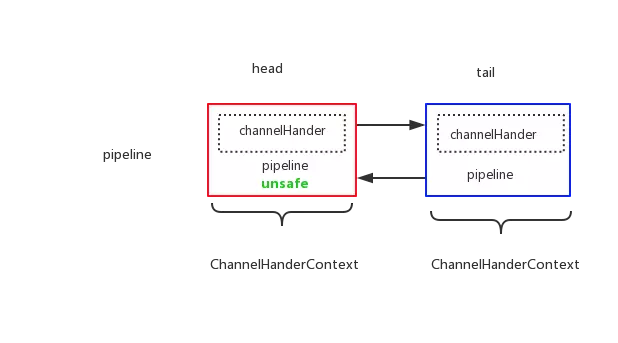

#### PipeLine的创建
创建Channel的时候就会创建PipeLine
```java
protected AbstractChannel(Channel parent) {
        this.parent = parent;
        this.unsafe = this.newUnsafe();
        this.pipeline = new DefaultChannelPipeline(this);
    }
```
调用·DefaultChannelPipeline`的构造方法
```java
public DefaultChannelPipeline(AbstractChannel channel) {
        if (channel == null) {
            throw new NullPointerException("channel");
        } else {
            //相当于上下文
            this.channel = channel;
            //设置头尾节点
            this.tail = new DefaultChannelPipeline.TailContext(this);
            this.head = new DefaultChannelPipeline.HeadContext(this);
            this.head.next = this.tail;
            this.tail.prev = this.head;
        }
    }
```


#### 向pipeline添加handler
```java
public ChannelPipeline addLast(ChannelHandler... handlers) {
        return this.addLast((EventExecutorGroup)null, (ChannelHandler[])handlers);
    }
public ChannelPipeline addLast(EventExecutorGroup executor, ChannelHandler... handlers) {
        if (handlers == null) {
            throw new NullPointerException("handlers");
        } else {
            ChannelHandler[] arr$ = handlers;
            int len$ = handlers.length;

            for(int i$ = 0; i$ < len$; ++i$) {
                ChannelHandler h = arr$[i$];
                if (h == null) {
                    break;
                }

                this.addLast(executor, this.generateName(h), h);
            }

            return this;
        }
    }

public ChannelPipeline addLast(EventExecutorGroup group, String name, ChannelHandler handler) {
        synchronized(this) {
            //检查是否名字重复
            this.checkDuplicateName(name);
            AbstractChannelHandlerContext newCtx = new DefaultChannelHandlerContext(this, group, name, handler);
            this.addLast0(name, newCtx);
            return this;
        }
    }
//产生独一无二的名字
private String generateName(ChannelHandler handler) {
        //用WeakHashMap作为缓存，记录ChannelHandler类型的名字是否起过
        WeakHashMap<Class<?>, String> cache = nameCaches[(int)(Thread.currentThread().getId() % (long)nameCaches.length)];
        Class<?> handlerType = handler.getClass();
        String name;
        synchronized(cache) {
            name = (String)cache.get(handlerType);
            if (name == null) {
                name = generateName0(handlerType);
                cache.put(handlerType, name);
            }
        }
        //basName+i,知道i没出现过
        synchronized(this) {
            if (this.name2ctx.containsKey(name)) {
                String baseName = name.substring(0, name.length() - 1);
                int i = 1;

                while(true) {
                    String newName = baseName + i;
                    if (!this.name2ctx.containsKey(newName)) {
                        name = newName;
                        break;
                    }

                    ++i;
                }
            }

            return name;
        }
    }

private void addLast0(String name, AbstractChannelHandlerContext newCtx) {
        //检查是否重复，如果没有被@Sharble修饰，不能添加多次，否则添加进去，added=true
        checkMultiplicity(newCtx);
        //插入双链表
        AbstractChannelHandlerContext prev = this.tail.prev;
        newCtx.prev = prev;
        newCtx.next = this.tail;
        prev.next = newCtx;
        this.tail.prev = newCtx;
        //把name,newCtx加入到map总，后来判断是否有重复
        this.name2ctx.put(name, newCtx);
        //回调用户handlerAdded()的逻辑
        this.callHandlerAdded(newCtx);
    }
```
#### 构造节点（注意是构造ChannelHandlerContext，也就是形成ChannelHandlerContext链表）
```java
DefaultChannelHandlerContext(DefaultChannelPipeline pipeline, EventExecutorGroup group, String name, ChannelHandler handler) {
        //判断是inBound还是outBound，返回boolean,然后构造出来
        super(pipeline, group, name, isInbound(handler), isOutbound(handler));
        if (handler == null) {
            throw new NullPointerException("handler");
        } else {
            this.handler = handler;
        }
    }
AbstractChannelHandlerContext(DefaultChannelPipeline pipeline, EventExecutorGroup group, String name, boolean inbound, boolean outbound) {
        if (name == null) {
            throw new NullPointerException("name");
        } else {
            this.channel = pipeline.channel;
            this.pipeline = pipeline;
            this.name = name;
            //绑定一个线程给pipeline
            if (group != null) {
                EventExecutor childExecutor = (EventExecutor)pipeline.childExecutors.get(group);
                if (childExecutor == null) {
                    childExecutor = group.next();
                    pipeline.childExecutors.put(group, childExecutor);
                }

                this.executor = childExecutor;
            } else {
                this.executor = null;
            }

            this.inbound = inbound;
            this.outbound = outbound;
        }
    }
```
#### 向pipeline删除handler
```java
public <T extends ChannelHandler> T remove(Class<T> handlerType) {
        //遍历找到要删除的ChannelHandlerContext
        return this.remove(this.getContextOrDie(handlerType)).handler();
    }
private AbstractChannelHandlerContext remove(final AbstractChannelHandlerContext ctx) {
        assert ctx != this.head && ctx != this.tail;

        AbstractChannelHandlerContext context;
        Future future;
        synchronized(this) {
            //在Reactor线程里面执行
            if (!ctx.channel().isRegistered() || ctx.executor().inEventLoop()) {
                this.remove0(ctx);
                return ctx;
            }
            //如果不在Reactor线程里面则封装成Task,等待被Reactor调度
            future = ctx.executor().submit(new Runnable() {
                public void run() {
                    DefaultChannelPipeline var1 = DefaultChannelPipeline.this;
                    synchronized(DefaultChannelPipeline.this) {
                        DefaultChannelPipeline.this.remove0(ctx);
                    }
                }
            });
            context = ctx;
        }
        //阻塞在这里,知道阻塞完成
        waitForFuture(future);
        return context;
    }

void remove0(AbstractChannelHandlerContext ctx) {
        //双链表的操作
        AbstractChannelHandlerContext prev = ctx.prev;
        AbstractChannelHandlerContext next = ctx.next;
        prev.next = next;
        next.prev = prev;
        //从缓存的nameMap移除掉
        this.name2ctx.remove(ctx.name());
        //回调用户函数
        this.callHandlerRemoved(ctx);
    }
```
ChannelHandlerContext的成员变量，就可以发现它保存的东西
```java
 volatile AbstractChannelHandlerContext next;
    volatile AbstractChannelHandlerContext prev;
    private final boolean inbound;
    private final boolean outbound;
    private final AbstractChannel channel;
    private final DefaultChannelPipeline pipeline;
    private final String name;
    private boolean removed;
    final EventExecutor executor;
```
DefaultChannelPipeline的成员变量（记住头尾节点就行）
```java
  private static final WeakHashMap<Class<?>, String>[] nameCaches = new WeakHashMap[Runtime.getRuntime().availableProcessors()];
    final AbstractChannel channel;
    final AbstractChannelHandlerContext head;
    final AbstractChannelHandlerContext tail;
    private final Map<String, AbstractChannelHandlerContext> name2ctx = new HashMap(4);
```


```java
 public final void read() {
            ChannelConfig config = AbstractNioByteChannel.this.config();
            if (!config.isAutoRead() && !AbstractNioByteChannel.this.isReadPending()) {
                this.removeReadOp();
            } else {
                ChannelPipeline pipeline = AbstractNioByteChannel.this.pipeline();
                ByteBufAllocator allocator = config.getAllocator();
                int maxMessagesPerRead = config.getMaxMessagesPerRead();
                Handle allocHandle = this.allocHandle;
                if (allocHandle == null) {
                    this.allocHandle = allocHandle = config.getRecvByteBufAllocator().newHandle();
                }

                ByteBuf byteBuf = null;
                int messages = 0;
                boolean close = false;

                try {
                    int totalReadAmount = 0;
                    boolean readPendingReset = false;

                    do {
                        byteBuf = allocHandle.allocate(allocator);
                        int writable = byteBuf.writableBytes();
                        int localReadAmount = AbstractNioByteChannel.this.doReadBytes(byteBuf);
                        if (localReadAmount <= 0) {
                            byteBuf.release();
                            byteBuf = null;
                            close = localReadAmount < 0;
                            break;
                        }

                        if (!readPendingReset) {
                            readPendingReset = true;
                            AbstractNioByteChannel.this.setReadPending(false);
                        }

                        pipeline.fireChannelRead(byteBuf);
                        byteBuf = null;
                        if (totalReadAmount >= 2147483647 - localReadAmount) {
                            totalReadAmount = 2147483647;
                            break;
                        }

                        totalReadAmount += localReadAmount;
                        if (!config.isAutoRead() || localReadAmount < writable) {
                            break;
                        }

                        ++messages;
                    } while(messages < maxMessagesPerRead);

                    pipeline.fireChannelReadComplete();
                    allocHandle.record(totalReadAmount);
                    if (close) {
                        this.closeOnRead(pipeline);
                        close = false;
                    }
                } catch (Throwable var16) {
                    this.handleReadException(pipeline, byteBuf, var16, close);
                } finally {
                    if (!config.isAutoRead() && !AbstractNioByteChannel.this.isReadPending()) {
                        this.removeReadOp();
                    }

                }

            }
        }
    }

    public ChannelPipeline fireChannelRead(Object msg) {
        this.head.fireChannelRead(msg);
        return this;
    }
```

```java
protected void doBeginRead() throws Exception {
        if (!this.inputShutdown) {
            SelectionKey selectionKey = this.selectionKey;
            if (selectionKey.isValid()) {
                this.readPending = true;
                int interestOps = selectionKey.interestOps();
                if ((interestOps & this.readInterestOp) == 0) {
                    selectionKey.interestOps(interestOps | this.readInterestOp);
                }

            }
        }
    }
```
#### pipeline中的inBound事件传播
```java
public ChannelPipeline fireChannelActive() {
        this.head.fireChannelActive();
        if (this.channel.config().isAutoRead()) {
            this.channel.read();
        }

        return this;
    }
public ChannelHandlerContext fireChannelActive() {
        final AbstractChannelHandlerContext next = this.findContextInbound();
        EventExecutor executor = next.executor();
        if (executor.inEventLoop()) {
            next.invokeChannelActive();
        } else {
            executor.execute(new OneTimeTask() {
                public void run() {
                    next.invokeChannelActive();
                }
            });
        }

        return this;
    }

     private AbstractChannelHandlerContext findContextInbound() {
        AbstractChannelHandlerContext ctx = this;

        do {
            ctx = ctx.next;
        } while(!ctx.inbound);

        return ctx;
    }

    private void invokeChannelActive() {
        try {
            //调用用户重写的channelActive方法
            ((ChannelInboundHandler)this.handler()).channelActive(this);
        } catch (Throwable var2) {
            this.notifyHandlerException(var2);
        }

    }
    
```
* 这里需要注意的地方是最后会调用用户重写的channelActive方法，如果重写了该方法，则执行逻辑，否则会执行默认的
```java
super.channelActive(ctx);

public void channelActive(ChannelHandlerContext ctx) throws Exception {
        ctx.fireChannelActive();
    }
```
这是一个递归调用，又回到最开始的fireChannelActive。直到最后一个结点。里面是个空方法，也就是递归的结束。
```java
 public void channelActive(ChannelHandlerContext ctx) throws Exception {
}
```
```java
//异常没有捕捉，传递到tail结点，给出如下警示
 public void exceptionCaught(ChannelHandlerContext ctx, Throwable cause) throws Exception {
            try {
                DefaultChannelPipeline.logger.warn("An exceptionCaught() event was fired, and it reached at the tail of the pipeline. It usually means the last handler in the pipeline did not handle the exception.", cause);
            } finally {
                ReferenceCountUtil.release(cause);
            }

        }
//消息没有处理，落到tail结点，给出如下警示。并丢弃
        public void channelRead(ChannelHandlerContext ctx, Object msg) throws Exception {
            try {
                DefaultChannelPipeline.logger.debug("Discarded inbound message {} that reached at the tail of the pipeline. Please check your pipeline configuration.", msg);
            } finally {
                ReferenceCountUtil.release(msg);
            }

        }
```

#### pipeline中的outBound事件传播
当时用channel.writeAndFlush(pushInfo)的时候，实际是一个outBound事件。
```java
public ChannelFuture writeAndFlush(Object msg, ChannelPromise promise) {
        return this.pipeline.writeAndFlush(msg, promise);
    }

public ChannelFuture writeAndFlush(Object msg, ChannelPromise promise) {
        return this.tail.writeAndFlush(msg, promise);
    }
public ChannelFuture writeAndFlush(Object msg, ChannelPromise promise) {
        if (msg == null) {
            throw new NullPointerException("msg");
        } else if (!this.validatePromise(promise, true)) {
            ReferenceCountUtil.release(msg);
            return promise;
        } else {
            this.write(msg, true, promise);
            return promise;
        }
    }

private void write(Object msg, boolean flush, ChannelPromise promise) {
        AbstractChannelHandlerContext next = this.findContextOutbound();
        EventExecutor executor = next.executor();
        if (executor.inEventLoop()) {
            next.invokeWrite(msg, promise);
            if (flush) {
                next.invokeFlush();
            }
        } else {
            Object task;
            if (flush) {
                task = AbstractChannelHandlerContext.WriteAndFlushTask.newInstance(next, msg, promise);
            } else {
                task = AbstractChannelHandlerContext.WriteTask.newInstance(next, msg, promise);
            }

            safeExecute(executor, (Runnable)task, promise, msg);
        }

    }

private void invokeFlush() {
        try {
            ((ChannelOutboundHandler)this.handler()).flush(this);
        } catch (Throwable var2) {
            this.notifyHandlerException(var2);
        }

    }

 private void invokeFlush() {
        try {
            ((ChannelOutboundHandler)this.handler()).flush(this);
        } catch (Throwable var2) {
            this.notifyHandlerException(var2);
        }

    }

 public ChannelHandlerContext flush() {
        final AbstractChannelHandlerContext next = this.findContextOutbound();
        EventExecutor executor = next.executor();
        if (executor.inEventLoop()) {
            next.invokeFlush();
        } else {
            Runnable task = next.invokeFlushTask;
            if (task == null) {
                next.invokeFlushTask = task = new Runnable() {
                    public void run() {
                        next.invokeFlush();
                    }
                };
            }

            safeExecute(executor, task, this.channel.voidPromise(), (Object)null);
        }

        return this;
    }

private AbstractChannelHandlerContext findContextOutbound() {
        AbstractChannelHandlerContext ctx = this;

        do {
            ctx = ctx.prev;
        } while(!ctx.outbound);

        return ctx;
    }
```

```java
public void write(ChannelHandlerContext ctx, Object msg, ChannelPromise promise) throws Exception {
            this.unsafe.write(msg, promise);
        }
```

#### Netty编码器
```java
public void write(ChannelHandlerContext ctx, Object msg, ChannelPromise promise) throws Exception {
        ByteBuf buf = null;

        try {
            //如果这个编码器适合处理这个对象
            if (this.acceptOutboundMessage(msg)) {
                I cast = msg;
                buf = this.allocateBuffer(ctx, msg, this.preferDirect);

                try {
                    //调用用户的编码逻辑
                    this.encode(ctx, cast, buf);
                } finally {
                    //释放掉
                    ReferenceCountUtil.release(msg);
                }

                if (buf.isReadable()) {
                    //如果可写，传递下去
                    ctx.write(buf, promise);
                } else {
                    buf.release();
                    ctx.write(Unpooled.EMPTY_BUFFER, promise);
                }

                buf = null;
            } else {
                ctx.write(msg, promise);
            }
        } catch (EncoderException var17) {
            throw var17;
        } catch (Throwable var18) {
            throw new EncoderException(var18);
        } finally {
            if (buf != null) {
                buf.release();
            }

        }

    }
```

#### Netty异常传播原理
```java
private void notifyHandlerException(Throwable cause) {
        if (inExceptionCaught(cause)) {
            if (DefaultChannelPipeline.logger.isWarnEnabled()) {
                DefaultChannelPipeline.logger.warn("An exception was thrown by a user handler while handling an exceptionCaught event", cause);
            }

        } else {
            this.invokeExceptionCaught(cause);
        }
    }

private void invokeExceptionCaught(final Throwable cause) {
    handler().exceptionCaught(this, cause);
}
```
* 当遇到异常的时候，就会调用上述代码。
```java
public void exceptionCaught(ChannelHandlerContext ctx, Throwable cause)
        throws Exception {
    ctx.fireExceptionCaught(cause);
}
public ChannelHandlerContext fireExceptionCaught(final Throwable cause) {
    invokeExceptionCaught(next, cause);
    return this;
}
```
* 递归调用，直到用户实现的的ChannelDuplexHandler,例如下面一个就是。
```java
public Exceptionhandler extends ChannelDuplexHandler {
    @Override
    public void exceptionCaught(ChannelHandlerContext ctx, Throwable cause)
            throws Exception {
        // 处理该异常，并终止异常的传播
    }
}
```
1. 所有的异常都会调用notifyHandlerException来处理。
2. 在处理过程的中，一直会寻找到下一个能处理的，直到最后一个ChannelDuplexHandler
3. OutBound的传递也是一样。一直往pipeline的下一个找。所以异常处理的ChannelDuplexHandler应该放到PipeLine的最后