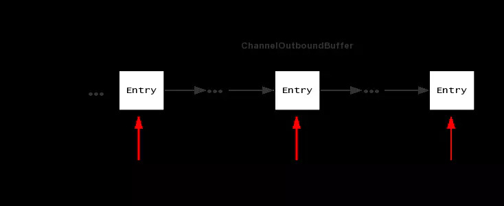
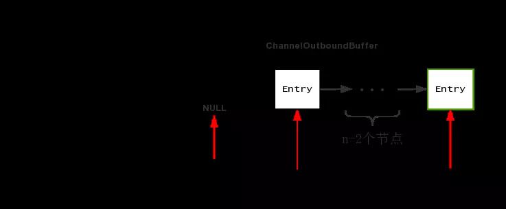

## writeAndFlush 分析
用户自定义处理器通常都是如下处理的
```java
@Override
    public void channelRegistered(ChannelHandlerContext ctx) throws Exception {
        ctx.writeAndFlush("getInfo");
    }
```
其中的writeFlush就把消息写到缓冲区，并flush。最后都到HeadContext
```java
   public void write(ChannelHandlerContext ctx, Object msg, ChannelPromise promise) throws Exception {
            this.unsafe.write(msg, promise);
        }
```
调用AbstractChannel的write方法
```java
 public final void write(Object msg, ChannelPromise promise) {
            ChannelOutboundBuffer outboundBuffer = this.outboundBuffer;
            if (outboundBuffer == null) {
                this.safeSetFailure(promise, AbstractChannel.CLOSED_CHANNEL_EXCEPTION);
                ReferenceCountUtil.release(msg);
            } else {
                int size;
                try {
                    //返回msg
                    msg = AbstractChannel.this.filterOutboundMessage(msg);
                    //估算msg的大小
                    size = AbstractChannel.this.estimatorHandle().size(msg);
                    if (size < 0) {
                        size = 0;
                    }
                } catch (Throwable var6) {
                    this.safeSetFailure(promise, var6);
                    ReferenceCountUtil.release(msg);
                    return;
                }

                outboundBuffer.addMessage(msg, size, promise);
            }
        }
```
* filterOutboundMessage(msg) 
写入队列，也就是把ChannelOutboundBuffer加入到unflushedEntry所指向的链表中
```java
public void addMessage(Object msg, int size, ChannelPromise promise) {
        ChannelOutboundBuffer.Entry entry = ChannelOutboundBuffer.Entry.newInstance(msg, size, total(msg), promise);
        if (this.tailEntry == null) {
            this.flushedEntry = null;
            this.tailEntry = entry;
        } else {
            ChannelOutboundBuffer.Entry tail = this.tailEntry;
            tail.next = entry;
            this.tailEntry = entry;
        }

        if (this.unflushedEntry == null) {
            this.unflushedEntry = entry;
        }

        this.incrementPendingOutboundBytes((long)size, false);
    }
```
ChannelOutboundBuffer 里面的数据结构是一个单链表结构，每个节点是一个 Entry，Entry 里面包含了待写出ByteBuf 以及消息回调 promise，下面分别是三个指针的作用

1.flushedEntry 指针表示第一个被写到操作系统Socket缓冲区中的节点
2.unFlushedEntry 指针表示第一个未被写入到操作系统Socket缓冲区中的节点
3.tailEntry指针表示ChannelOutboundBuffer缓冲区的最后一个节点
第n次调用 addMessage之后，各个指针的情况为

可以看到，调用n次addMessage，flushedEntry指针一直指向NULL，表示现在还未有节点需要写出到Socket缓冲区，而unFushedEntry之后有n个节点，表示当前还有n个节点尚未写出到Socket缓冲区中去

* Flush
