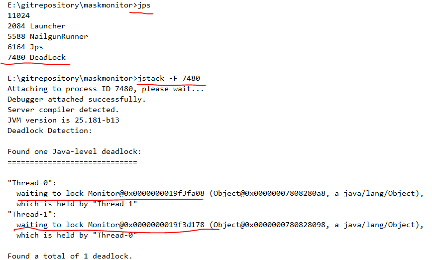

### 死锁的重现和检测

> 运行下面程序就会发生死锁，关键之处在于两个线程都在在第一次获取锁后，睡眠。并且获取锁的顺序是相反的

```java
public class DeadLock {
    static Object lock1 = new Object();
    static Object lock2 = new Object();
    public static void main(String[] args) {

        Thread thread1 = new Thread(() -> {
            synchronized (lock1){
                try {
                    Thread.sleep(1000);
                }catch (InterruptedException e){
                    e.printStackTrace();
                }
                synchronized (lock2){
                    System.out.println(Thread.currentThread().getId());
                }
            }
        });

        Thread thread2 = new Thread(() -> {
            synchronized (lock2){
                try {
                    Thread.sleep(1000);
                }catch (InterruptedException e){
                    e.printStackTrace();
                }
                synchronized (lock1){
                    System.out.println(Thread.currentThread().getId());
                }
            }
        });

        thread1.start();
        thread2.start();
    }
}
```

### 2. 通过jstack命令去检测死锁的发生
