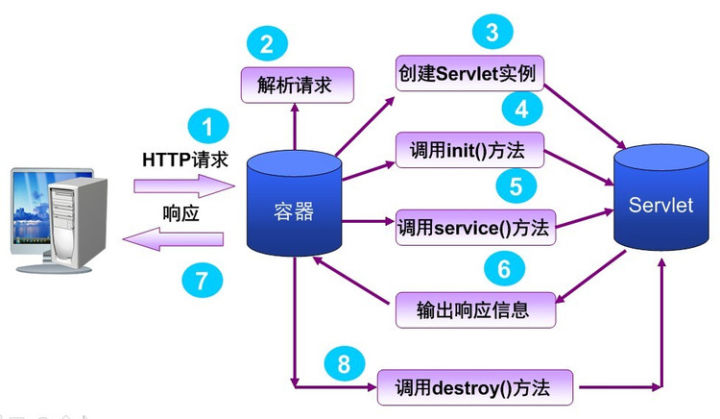

### Servlet 笔记

Servlet的请求过程用下面这个图描述

#### Servlet的生命周期：

1. 调用 init() 方法初始化
2. 调用 service() 方法来处理客户端的请求
3. 调用 destroy() 方法释放资源，标记自身为可回收
4. 被垃圾回收器回收

>Servlet可以单例(同一个Servlet可以匹配多个url),也可以是多例(声明多个同样类型的Servlet)。Servlet线程安全安全跟是否单例没有关系，在2.4版本后，线程安全交给开发者自己去控制。（之前可以通过SingleThreadModel来实现线程安全，后来废除了，因为doService方法的同步影响性能）
